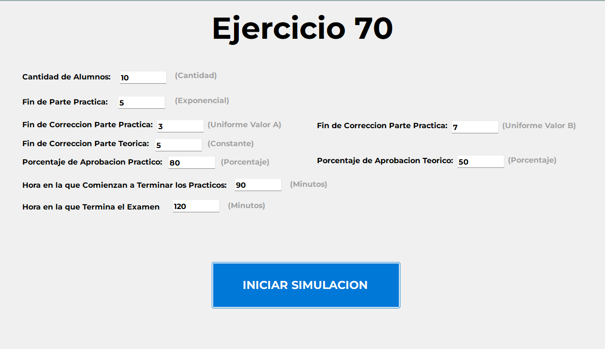
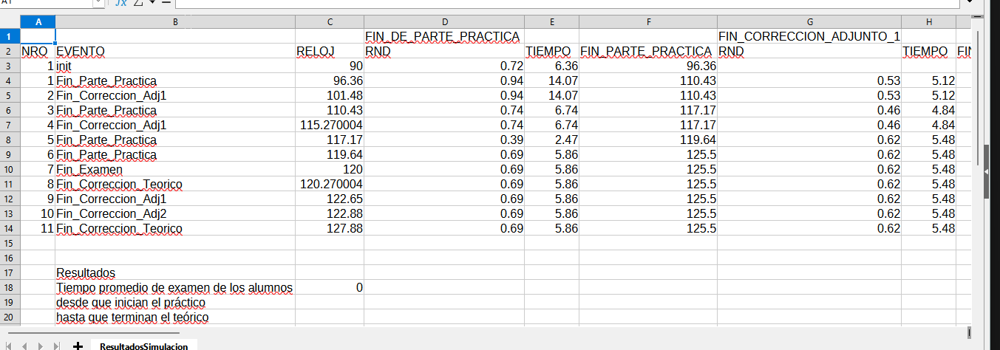

# Simulación de Examen Final - Ejercicio 70

## Enunciado

> En el examen final de “Desarrollo Bajo Lenguajes Visuales” el lunes pasado, varios de los alumnos  
> que se presentaron pudieron finalizar a tiempo la parte práctica del mismo, que había sido definida  
> por el titular de cátedra en 2 horas.  
>
> Luego de transcurridos 1 h. 30m. de examen comenzaron a terminar la parte práctica los alumnos,  
> aproximadamente uno cada 5 minutos, distribuidos exponencialmente. Cuando un alumno termina el  
> examen práctico, es evaluado por alguno de los profesores adjuntos y luego, si aprueba, pasa a  
> rendir el examen teórico con el titular de la cátedra, el cual tarda 5 minutos en evaluar a cada  
> alumno.  
>
> Luego de 2hs de iniciada la parte práctica, se da por terminada la misma, y los alumnos que no  
> finalizaron, son automáticamente aplazados. De los alumnos que si finalizan, aprueban la parte  
> práctica el 80%, y de estos últimos, el 50% aprueba la materia.  
>
> ¿Cuál es el tiempo promedio de examen desde que inician el práctico hasta que terminan el teórico,  
> los alumnos que son aprobados? (Se presentaron a rendir 10 alumnos)  
>
> Nota: Hay dos profesores adjuntos, y cualquiera de los dos demora 5±2 minutos en evaluar la parte  
> práctica de un alumno.

---

## Descripción del Proyecto

Este proyecto es una **simulación interactiva** desarrollada en **C#** para resolver el problema planteado en el enunciado. Permite ajustar parámetros clave del examen y genera los resultados en un archivo Excel.

### Tecnologías utilizadas:

- 💻 Lenguaje: **C#**
- 📄 Salida: **Archivo Excel (.csv)**
- 📊 Interfaz Gráfica: **WinForms/WPF**

---

## Funcionamiento

1. El usuario ingresa los parámetros de simulación:
   - Cantidad de alumnos
   - Distribución de tiempo de finalización de la parte práctica (exponencial)
   - Tiempo de corrección práctica (uniforme entre A y B)
   - Tiempo de corrección teórica (constante)
   - Porcentajes de aprobación
   - Horarios de inicio/fin
2. Se simula el flujo completo desde que los alumnos inician hasta que terminan su evaluación.
3. Se genera un archivo **ResultadosSimulacion.csv** con todos los eventos.
4. Se calcula el **tiempo promedio de examen** desde el inicio práctico hasta la finalización teórica de los aprobados.

---

## Interfaz de Usuario

### Pantalla Principal

---

## Ejemplo de Resultados

---

## Autor

Proyecto realizado como parte del examen final de la materia Simulacion.

